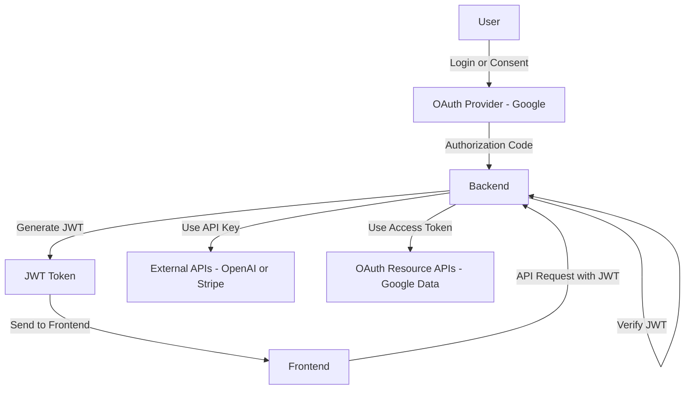
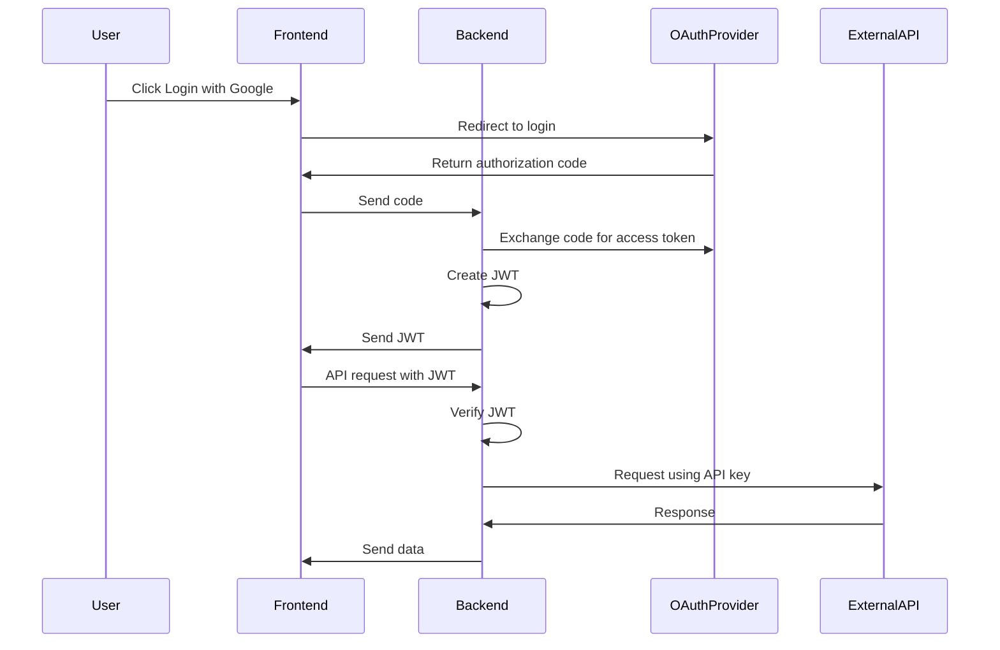

# Application-Programming-Interface-API-Notes

## 🔗 API Key vs JWT vs OAuth – Mermaid Diagram

> ✅ Clean version (GitHub-safe, no parsing errors)

---

## 🧠 How to Read This Diagram

### 🔐 OAuth (Login)

* User logs in via Google
* Backend receives authorization code and exchanges it for tokens

---

### 🔑 JWT (Session)

* Backend creates JWT
* Frontend uses JWT for authenticated requests

---

### 🔗 API Key (External Services)

* Backend uses API keys to call external services:

  * OpenAI
  * Stripe

---

## 📦 Sequence Diagram (Also Fixed)

---

## ⚡ One-Line Summary

**OAuth = login → JWT = session → API key = external API access**

---

