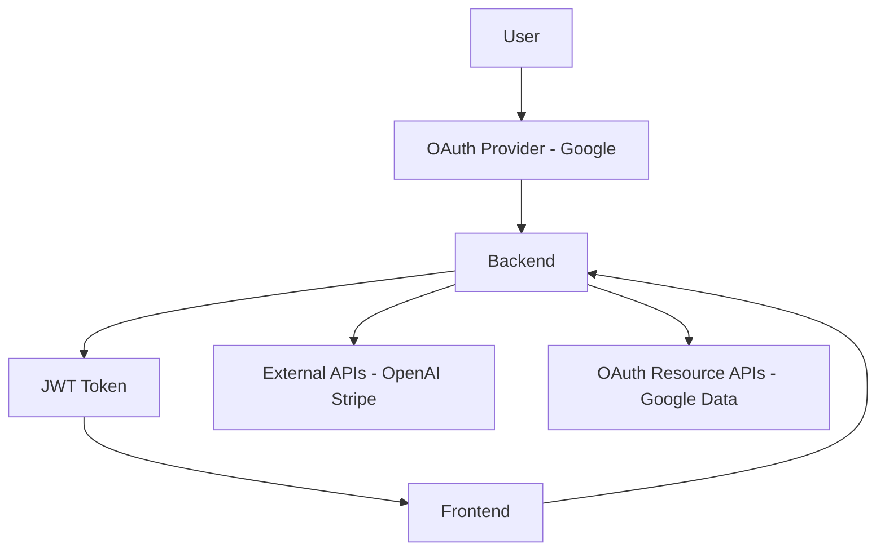
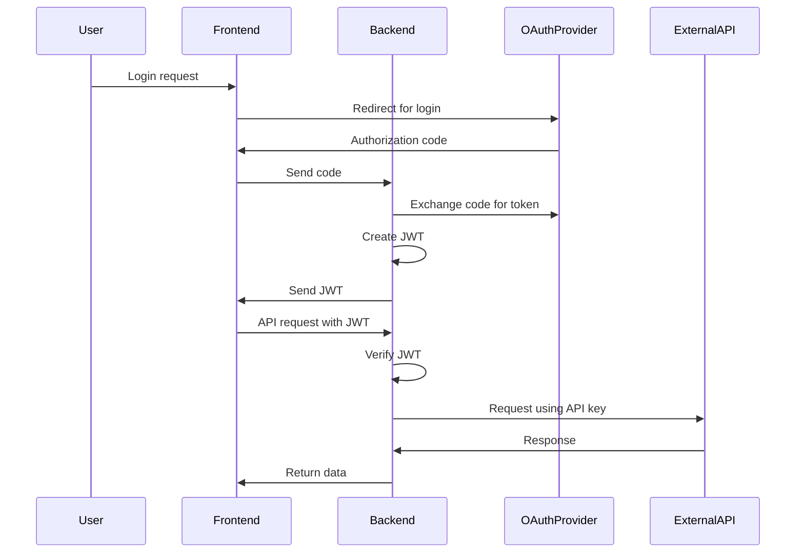

# Application-Programming-Interface-API-Notes

## 🔗 API Key vs JWT vs OAuth – System Diagram

> ✔️ GitHub-safe Mermaid (tested style: no emojis in nodes, clean labels)

---

## 🧠 How It Works

### OAuth (Login)

* User logs in using Google
* OAuth provider returns authorization code
* Backend verifies and continues flow

---

### JWT (Session)

* Backend creates JWT after login
* Frontend stores and sends JWT with requests
* Backend verifies JWT on every request

---

### API Key (External Services)

* Backend uses API keys to access external services like:

  * OpenAI
  * Stripe

---

## 📦 Sequence Diagram (Fixed Version)

---

## ⚡ One-Line Summary

**OAuth = login identity | JWT = user session | API Key = external service access**

---
