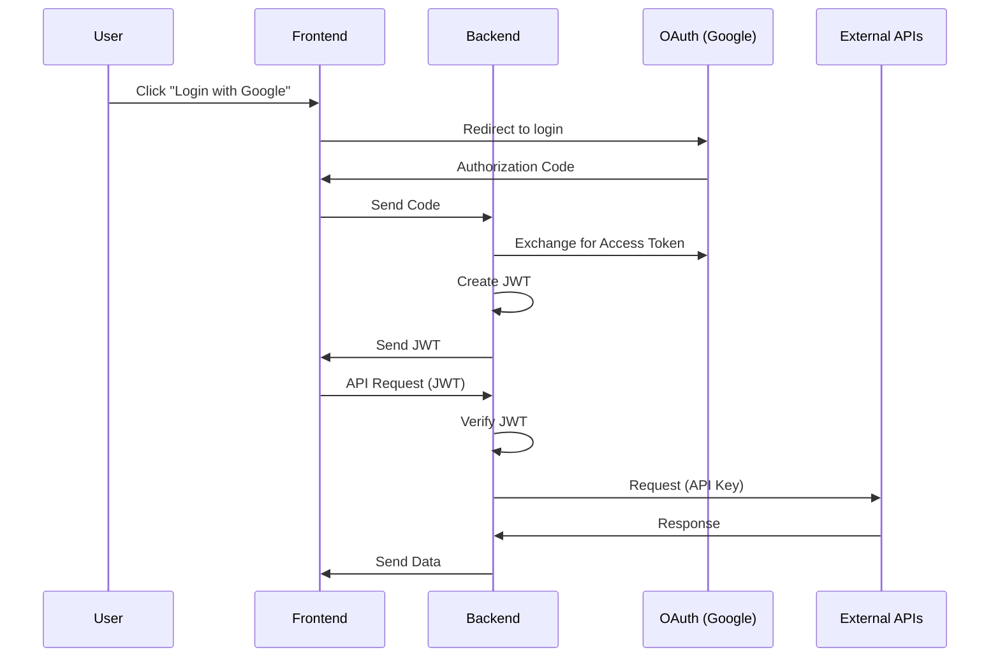

# Application-Programming-Interface-API-Notes


##  API Key vs JWT vs OAuth – Mermaid Diagram 


```mermaid
flowchart TD

    A[ User] -->|Login / Consent| B[ OAuth Provider (Google)]

    B -->|Authorization Code| C[ Your Backend]

    C -->|Generate| D[ JWT Token]
    D -->|Send to| E[ Frontend]

    E -->|API Requests with JWT| C

    C -->|Verify JWT| C

    C -->|Use API Key| F[ External APIs (OpenAI, Stripe)]

    C -->|Use Access Token| G[ OAuth Resource APIs (Google Data)]

```

---

##  How to Read This Diagram

###  OAuth (Login)

* User logs in via Google
* Your backend receives authorization and tokens

---

### 🔑 JWT (Session)

* Backend creates JWT
* Frontend uses it for authenticated requests

---

### 🔗 API Key (External Services)

* Backend uses API keys to talk to services like:

  * OpenAI
  * Stripe

---

## 📦 Optional: Sequence Diagram Version



---

## ⚡ One-Line Summary

**OAuth = login → JWT = session → API Key = external API access**

---


